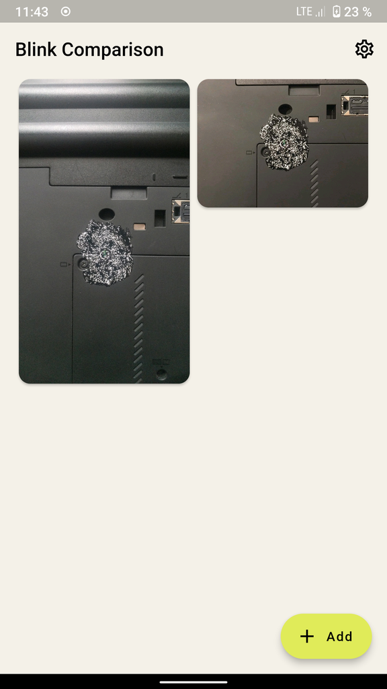
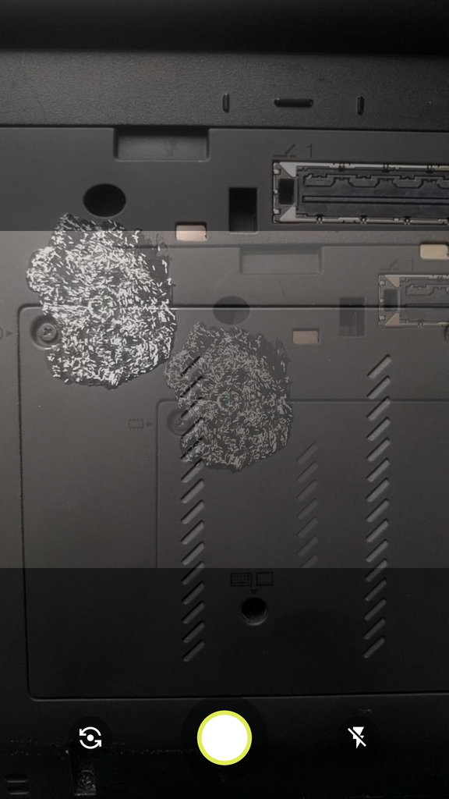
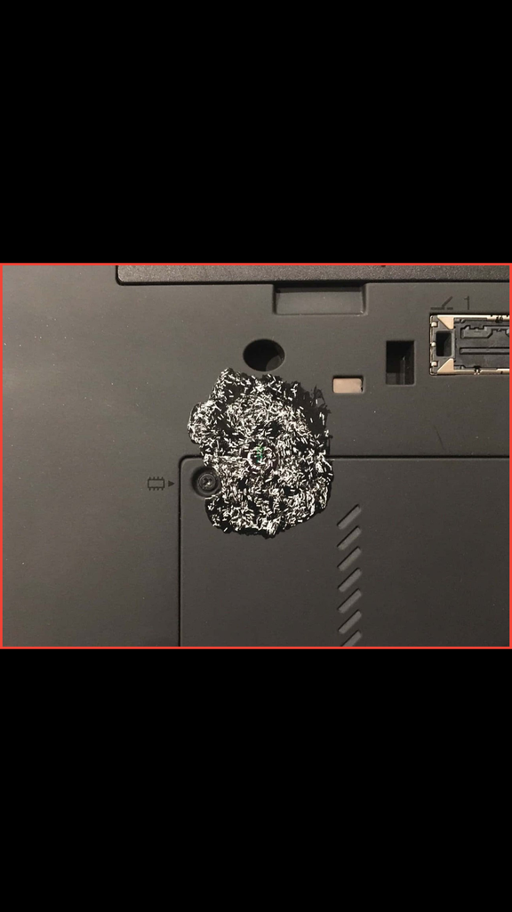
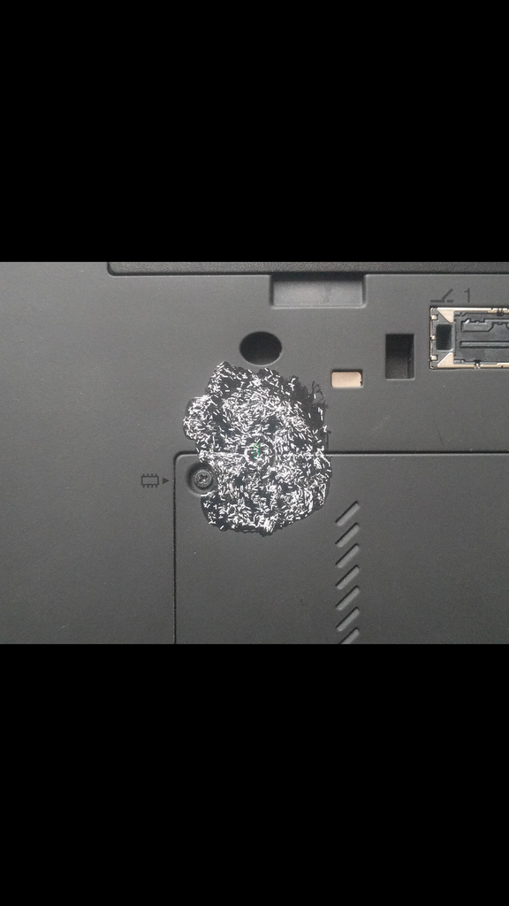

<h2><b>TamperChek</b></h2>
<h4>Simplifies comparing photos of tamper-evident seals and patterns using your eyes.</h4>

----

## Screenshots

## Description
TamperCheck uses the concept of blink comparison.
The concept of "blink comparison" method is simple - the app allows you to quickly switch pictures without delay so you can see the differences.
## 📋 Features

 - Add and store reference pictures in the app or take a photo on the spot; all pictures are encrypted, making it harder to steal or replacement
 - Compare a reference image with the one just taken using "blink comparison" method
 - Helps to take a compared photo in the correct position, at the correct angle, lighting and distance
 - Material Design
 - Night theme
 - Responsive UI for different devices form factors

## 🔒 Security

All reference images that added to the app stored as encrypted, making it harder to steal or replacement. 
## 🖥️💻📱 Available platforms

 - Android
